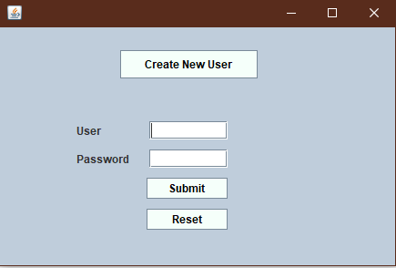

# RecipeBook
Desktop Java application using Swing GUI and SQL Server database.

<h3>
Description
</h3>
This locally hosted application allows the user to store the description, instructions, ingredients, difficulty, and
time needed to prepare their favorite recipes. Multiple users are allowed and users can add, edit, or delete their entries. A new 
table is added and attached in the SQL Server database for each user created.
 
<h3>
Features
</h3>
<h5>* User login</h5>
<h5>* Create new users</h5>
<h5>* Username/password authentication</h5>
<h5>* Create new recipe entries</h5>
<h5>* Read and cycle through existing entries</h5>
<h5>* Update existing entries</h5>
<h5>* Delete unwanted entries</h5>
<h3>Images</h3>

